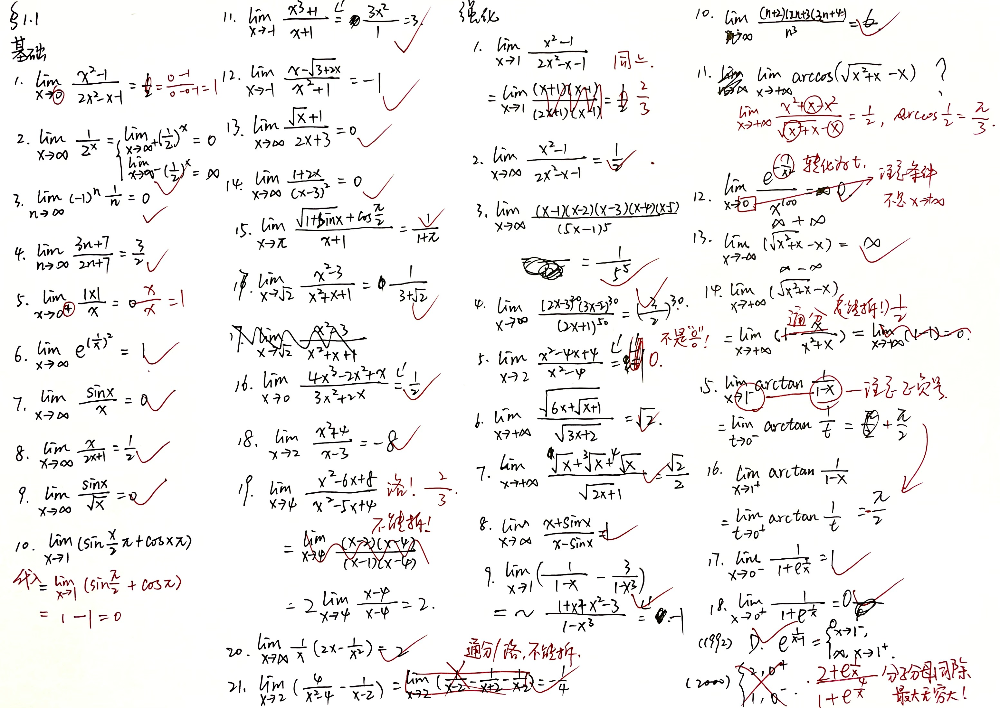

# 三大计算

??? note "2024-03-02 1-1 求极限的入门"

    
    
    经验：
    
    1. 无穷-无穷，通分 【基础-19/21，强化11/14】
    
    2. 分式不能拆【强化-1/5】
    
    3. 注意变量的趋近，并且讨论正负【基础-1/5，强化-12/15】
    
    4. 分子分母同除最大无穷大【强化-(2000)】
