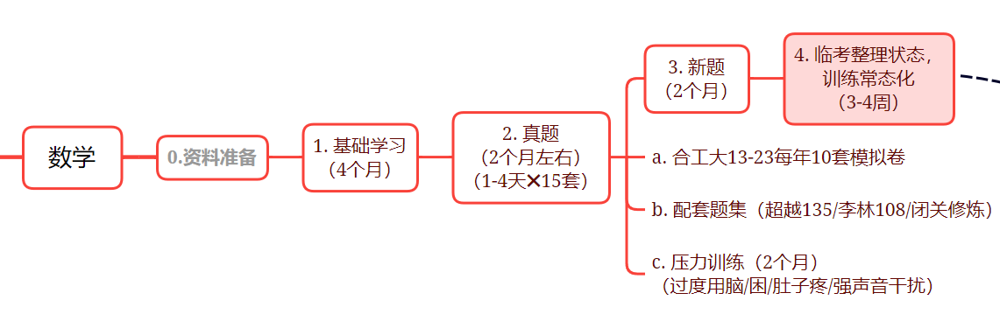
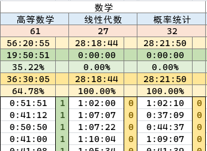

# 睿的数学规划-20230317

> 准备的是数学一，打算考11408，到九月视学习成果来定学校，当前奔着软微复习，没啥科研理想。

## 当前情况

看基础课中。从高数（汤家凤）开始看的，高数看到不定积分了。但没做题，只跟着走了例题。这两天找回教材书，打算从入门/基础题开始（不知道教材习题够不够入门和基础）。

课程与书的准备：

1. 高数：汤家凤课+教材习题+1800+数学复习全书
2. 线代：汤家凤课+教材习题+1800+数学复习全书
3. 概率论：余炳森+教材习题+余炳森讲义

## *欠缺的地方*

高中数学的基础忘了很多了，前几天做时间复杂度的题，等比数列都忘了怎么求了。虽然高考考了120，但是总不练习还是会荒废手感。

三角函数那里，cot/sec/csc以及反三角函数高中没基础，大学上来都完全是懵的。不过怎么说呢，做做题也就熟悉一些了。

这学期还重修着概统呢（打算免听），至于重修的原因，就是那次期末碰巧懒得去了。

## 自己的学习方法

总体分三步走：基础课+强化+冲刺

最重要的是基础，“基础不牢，地动山摇”，确实是这样。

> 回顾我自己的经历，中考还能考个118/120，高考只能考120/150了，寻找原因，其实就是高一高二不打牢基础，周六日寒暑假天天玩了（高一作业都糊弄不太好好写）；反倒是初中的时候练的题又多又好，基础就扎实，难题的思路都不大卡。

所以我对基础阶段的学习安排是：

1. 跟着汤老师基础课走，深入理解例题，做到例题每一步的思路都能详解（我会在例题旁做一些注释来让自己理解透彻，关于笔记，我会定期拍照上传到我[**博客**](math.haohaha.cn)，做好目录，以便随时查看）；
2. 找入门题练，练会了再练基础，每一档做到很扎实很扎实才敢提高练习难度（***不过说实话，我还不是很敢确定教材习题能不能当入门，习题册这方面，我有点拿不准***）；其实我做习题完全可以自己做完订正答案然后绝大部分可以想明白答案的思路（当然有文文姐之后肯定更踏实了，有些题不会的时候不用死磕了），所以**我觉得我就是练得少**。
3. 关于题量，我身体和脑子应该能撑得住（我觉得我应该不会比高三做的题还多了）；
4. 仍需要与大家进度基本看齐，有一个良好的社区氛围对我来说很重要，不然我就会放纵自己啦。

强化阶段，在基础打的足够扎实之后再说，我觉得基础打的足够好，应该来说，强化不用太多太多时间，七八两个月差不多吧？具体的习题，我想我有三本书（***其实也拿不准什么时候用，因为还不了解难度***）：蔡燧林-高数，李正元&&李永乐-线代，余炳森-概率论。

九月报名前我得基本上有个测试的稳定的成绩了，不然也没办法参考着成绩来报考学校。

***冲刺阶段想的不多***，目前只是知道用套卷来巩固，具体巩固嘛，我打算做一些全真模拟，以及一些极限条件下的模拟测试（比如脑子不清醒的时候写一套）。***套卷的用法我还没形成很明确的思考。***

## 规划图+进度表

进度表具体可看金山在线文档（[**点这里**](https://www.kdocs.cn/l/cm0BWaefKmXG)）

